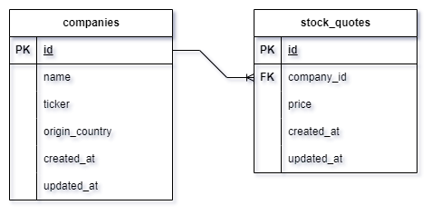

# StockQuotes API

This API serves as a backend for application for managing stock quotes and related companies. Below are the instructions for getting started, running tests, and accessing additional resources.

## Link To Video Tutorial

I have also created video, in which I showed how to start the application, how to run tests, how I did the commits, how I decided to do the `there can be multiple clients sending stock quotes concurrently` part of the assignment and much more. Therefore, I highly recommend that the person who will be assessing my assignment reads this material.
Link:
https://www.youtube.com/watch?v=RDUFS7WAhHw

## Getting Started

To start the server, follow these steps:

1. Make sure you have Ruby and Rails installed on your system.
2. Clone this repository to your local machine.
3. Navigate to the project directory.
4. Run the following commands:
```console
bundle install
rails db:create
rails db:migrate
rails server

```
The server will start running at `http://localhost:3000`.

## Running Tests

To run tests, execute the following command in the console:
```console
rspec
```
## Data Model

The data model for this API is depicted in the `data-model.png` file. You can find it in the root directory of this project.



## Postman Collection

A Postman collection named `collection.json` is provided with this project. It's in `Postman` directory. You can import this collection into Postman to test the endpoints of the API. 

## Swagger Documentation

Swagger documentation for this API will be available at the following URL once the server is running:

http://localhost:3000/api-docs/index.html
